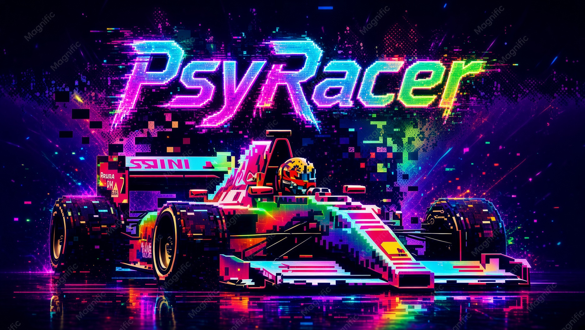

# PsyRacer V1.0

**by Diamond Hand Dev** (DiamondHand.Dev)



A colorful terminal arcade racer. Drive a pseudo-3D highway, dodge traffic, and reach the finish line.


## Features

- Pseudo-3D highway with curves, trees, and buildings
- Five AI Indy cars on the grid with you
- Starting lights: red, red, red, then green (3, 2, 1, GO!)
- Checkered finish line with a crowd
- Easy 10,000 m / Medium 20,000 m / Hard 30,000 m
- High scores
- Color-cycling menus and splash screen
- Background music with on/off in the menu

## Requirements

- [Python 3.10](https://www.python.org/downloads/) or newer
- Windows, with a color-capable terminal such as Windows Terminal
- No extra pip packages — the game uses the Python standard library

> Built and tested on **Windows**. Keyboard, RGB color, and music use the Windows console APIs.

## How to play

Clone the repo and keep the `Assets` folder next to `racer.py`.

```bash
git clone https://github.com/IcarusConsulting/PsyRacer.git
cd PsyRacer
```

On Windows, start it with:

```powershell
python racer.py
```

If `python` is not found, try `py racer.py`. Click the terminal so it has focus. A regular terminal works better than double-clicking the file.

## Controls

The splash screen shows a side-view car on a looping road. Press **Enter** to reach the main menu.

On menus, move with the arrow keys and confirm with Enter. Number keys still work as shortcuts.

| Action | Key |
| --- | --- |
| Leave splash / confirm | `Enter` |
| Move menu highlight | `Up` / `Down` |
| Select highlighted item | `Enter` |
| Jump to a menu item | `1`–`4` |
| Accelerate | `W` or `Up` |
| Brake | `S` or `Down` |
| Steer | `A` / `D` or `Left` / `Right` |
| Return to menu | `Esc` or `Q` |

### Game modes

1. **Start Race** — pick Easy, Medium, or Hard, then take the grid.
2. **High Scores** — best distances by difficulty.
3. **Music: On/Off** — pause or resume the background track.
4. **Exit**

Stay on the asphalt. Hitting another car slams the brakes. Lights go red-red-red-green, then you race five AI cars to a packed finish line.

## Project layout

```text
PsyRacer/
├── racer.py
├── README.md
├── .gitignore
├── Assets/
│   ├── Background Music.mp3
│   ├── PsyRacerSplash.jpg
│   └── PsyRacerSplash.mp4
└── racer_scores.txt            # created locally after a race
```

You can replace `Assets/Background Music.mp3` with another MP3 of the same name.

## Troubleshooting

- **Nothing happens when you press keys** — click the terminal so it is the active window.
- **Colors look wrong** — use a modern terminal with 24-bit color (Windows Terminal is a good choice).
- **No music** — confirm `Assets/Background Music.mp3` is in the project folder and that system volume is not muted.
- **`python` not found** — install Python 3, enable **Add python.exe to PATH**, and reopen the terminal.

## GitHub social preview

`Assets/PsyRacerSplash.jpg` is the game cover. Set it as the social preview so Discord, X, Slack, and GitHub show this art when the link is shared:

1. Open the repo on GitHub
2. **Settings → General → Social preview**
3. Upload `Assets/PsyRacerSplash.jpg`

## Credits

- **Game** — Diamond Hand Dev (DiamondHand.Dev)
- **Title** — PsyRacer V1.0
- **Engine** — Python 3, standard library only
- **Music** — `Assets/Background Music.mp3`
- **Cover** — `Assets/PsyRacerSplash.jpg`

Made with a grid, a finish line, and too many colors.

---

© Diamond Hand Dev. All rights reserved.
