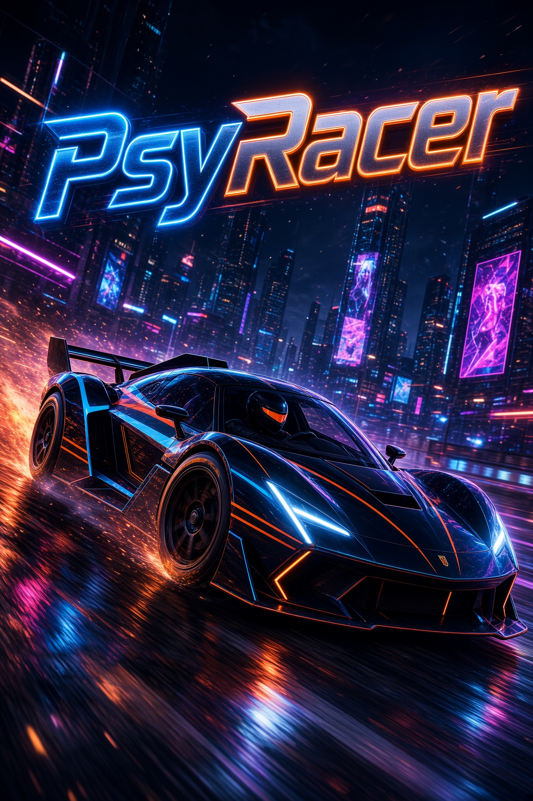

# PsyRacer v0.10

**by DiamondHand.Dev**




1080p night-highway racer. Neon wet asphalt, a black hypercar, overhead Japanese-style gantries, and a cyberpunk skyline that grows toward the finish. Alpha rebuild of the pygame V1.0 slice in **Godot 4**.

## Requirements

- [Godot 4.7.2](https://godotengine.org/download/archive/4.7.2-stable/) (Forward+)
- Windows

Open this folder in Godot and press Play. Main scene is `scenes/boot.tscn`.

## How to play

| Action | Key |
| --- | --- |
| Start race | `Enter` |
| Accelerate | `W` or `Up` |
| Brake | `S` or `Down` |
| Steer | `A` / `D` or `Left` / `Right` |
| Mute music | `M` |
| Back to title | `Esc` |

Five AI cars share the grid with you. Lights go red-red-red-green, then you race to the finish. Hitting another car cuts both of you to half of max speed.

On the splash, press Enter to play the visor intro (muted), then a white flash drops you onto the grid. Title and UI stay up until that flash.

## Menu and settings

The **MODE** and **OPTIONS** buttons are animated toggles; only one overlay can be open at a time. Mode detail pages use the supplied images in `samples/`, and the overlays keep a clear, even gap above the bottom menu bar.

Under **OPTIONS → CONTROLS → KEYBOARD BINDINGS**, select Accelerate, Brake / Reverse, Left, or Right and press a key to stage a new binding. Press `Esc` while waiting to cancel. **Apply Settings** commits the staged bindings. WASD and arrow keys are the defaults.

Under **OPTIONS → AUDIO**, Music volume updates in realtime in 10% increments. **Apply Settings** commits the selected audio settings.

## Look

Cover art `assets/PsyRacerSplash.jpg` is the style bible: wet asphalt, cyan/orange neon, black hypercar, night city.

- Horizon city eases closer as you near the finish
- Color-cycling matrix rain wraps the sky and dies at the horizon
- Streetlamp LED bulbs, no light cones
- NEXCO-style overhead signs every 2000 m
- Cars use the imported GLB models in `assets/cars/`, with primitive geometry as a fallback if a model fails to load

### Chase mode

The police car merges at 3,000 m and pursues the player. After the merge, stationary police roadblocks are placed ahead every 2,500 m (5,500 m, 8,000 m, 10,500 m, and so on). Roadblocks are randomized across safe roadway positions, remain persistent, and are visible in the extended forward view so they can be avoided. Hitting one immediately busts the player; an AI racer that hits one is removed.

Highway kanji uses **Yu Gothic** when the font file is present locally, otherwise the matching Windows system font.

## Project layout

```text
PsyRacer/
├── project.godot
├── README.md
├── assets/          # splash, music, sprites, intro video
├── scenes/          # boot title, race
├── scripts/
├── shaders/
└── samples/         # mode images and Imagine reference clips
```

Replace `assets/Background Music.mp3` with another MP3 of the same name if you want a different track.

## Credits

- **Game** — DiamondHand.Dev
- **Title** — PsyRacer v0.10 (alpha)
- **Engine** — Godot 4.7.2
- **Music** — `assets/Background Music.mp3`
- **Cover** — `assets/PsyRacerSplash.jpg`

---

© DiamondHand.Dev. All rights reserved.
